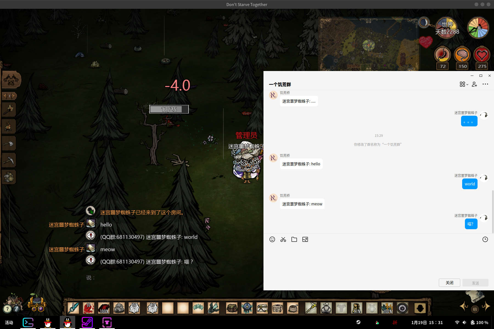

# 连接一个饥荒档和一个qq群的桥

虽然大概没人用, 但还是介绍一下吧

## 这个是啥

来, 看图

## 使用方式

### qq和饥荒部分
 - 准备一个qq群, qq群里有一个用于收发消息的qq号, 不建议使用自己日常使用的qq号, 不然自己发的消息不能在饥荒中看到
 - 准备一个饥荒档, 饥荒档需要在tmux中启动
 - 给饥荒服务器所在的tmux window起个名字, 我用的是dst, 如果这个饥荒档有多个shard服务器, 随便选择一个服务器即可, 如果这个window里有多个pane, 记住要聚焦到饥荒服务器所在的pane

### go-cqhttp部分
 - 装个go-cqhttp
 - 运行go-cqhttp, 选择"反向 Websocket 通信"来生成配置文件
 - 修改生成出来的`config.yml`, 修改qq号(`account.uin`)为用于收发消息的qq号码, 修改ws地址(`servers.ws-reverse.unversal`)为`ws://localhost:8080/onebot/v11/ws`, 这个端口是nonebot默认的端口,  如果想修改要一起修改
 - 重新运行go-cqhttp

### nonebot部分
 - 修改`.env`文件中的参数, 包括其中的qq群号(`QQGROUPID`), 饥荒的聊天日志文件路径(`DSTCHATLOG`), tmux的绝对路径(`TMUXPATH`), 饥荒服务器所在的tmux window的名字(`DSTWINDOWNAME`), 如果在go-cqhttp中使用的不是默认的8080端口, 这里需要加一个端口参数(`PORT`)
 - 准备个python的运行环境, 用pip装一下`nonebot`, `nonebot_adapter_onebot`, `asyncinotify`这3个包
 - 在这个目录跑`python bot.py`, 然后应该就可以了

## 遇到问题

如果遇到故障的话发issue就发issue吧, 虽然我大概率解决不了, 但我可以传到上游去.
如果是压根没看懂"使用方式"的话就别发issue了, 直接找我qq(1310718106)吧, 我这个"使用方式"写得比较随便, 并没有怎么换位思考新手的视角, 我可以帮你搭好, 希望之后你能帮我把"使用方式"修改得你能看懂.

## 还有点话

虽然我的qq群号在`.env`里, 但别加, 里面没啥好玩的, 真的
